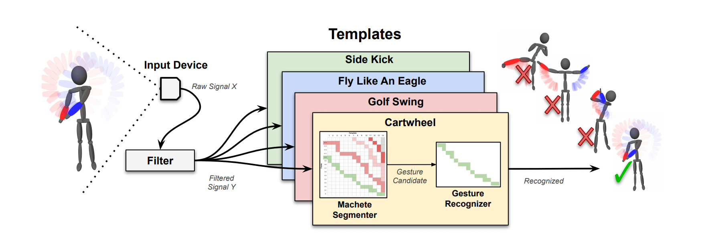

# Machete
Machete is a straightforward segmenter one can use to isolate custom gestures in continuous input. Machete uses traditional continuous dynamic programming with a novel dissimilarity measure to align incoming data with gesture class templates in real time. This segmenter is computationally efficient, accurate, device-agnostic, and works with a single training sample.

## Dataset
Four high activity (HA) [datasets](https://github.com/ISUE/Machete/tree/main/datasets) can be downloaded with this repository. The datasets include Kinect, Mouse and Vive Controllers continuous input and gesture training data. The Vive Controllers dataset is split into Positional and Rotational data during runtime, which are evaluated separately.

## Usage
A reference Machete implementation is available in C#, designed to run in Unity. After cloning the repository (`git clone https://github.com/ISUE/Machete`), open the Machete scene with Unity 2017 or above. 

In the scene, `EvaluationLoader.cs` script is attached to MacheteLoader object. This instance of the `EvaluationLoader` controls the train count, iteration count, Device Type and Segmentation Type, which you can change in the Unity Inspector tab. Press the Unity Play button to start the segmentation. Results will be printed to console, and saved to a `stats.csv` file in the repository root directory.

Because of Machete's intended use, the segmentation steps are integrated into Unity's main loop. To see how the frames are fed to the segmenter and the recognizer, refer to `Step()` functon in the `EvaluationLoader.cs`. 

# Citing
When using Machete or the Machete dataset, please reference the following paper:

    @article{taranta2021machete,
     title={Machete: Easy, Efficient, and Precise Continuous Custom Gesture Segmentation},
     author={Taranta II, Eugene M and Pittman, Corey R and Maghoumi, Mehran and Maslych, Mykola and Moolenaar, Yasmine M and Laviola Jr, Joseph J},
     journal={ACM Transactions on Computer-Human Interaction (TOCHI)},
     volume={28},
     number={1},
     pages={1--46},
     year={2021},
     publisher={ACM New York, NY, USA}
    }

# Contributions and Bug Reports
Contributions are welcome. Please submit your contributions as pull requests and we will incorporate them. Also, if you find any bugs, please report them via the issue tracker.

# License
Machete can be used freely for academic and research purposes. More details are [available in our license file](https://raw.githubusercontent.com/ISUE/Machete/main/LICENSE).